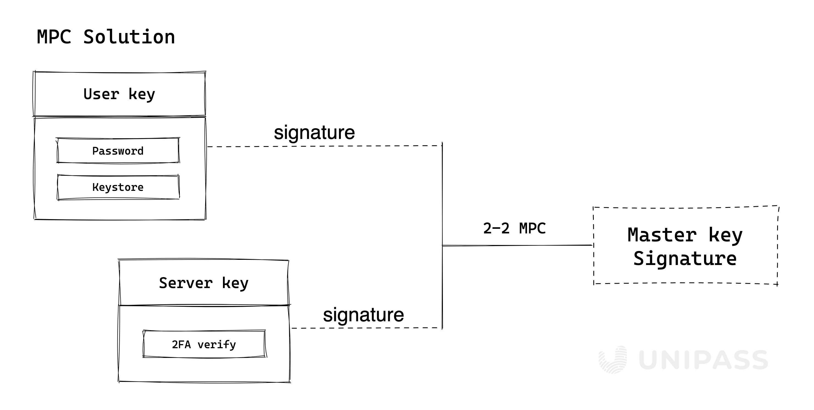

# Master Key

## Structure of master key

UniPass Wallet uses a 2-2 Threshold Signature Scheme for the Master key.

A user’s master key consists of 2 secret shares:

- `User key` that is encrypted and stored locally in user’s device. It would not be able to be exported.
- `Server key` that is stored on UniPass’ server and used for 2FA, which will support email, text message, Google Authenticator, OAuth, WebAuthn, etc.

## What is TSS

The Threshold Signature Scheme (TSS) is a cryptographic technique for distributed key generation and signature and is a subsection of Secure Multi-Party Computation (MPC or SMPC).

TSS enables customizable threshold policy definition and can assist numerous parties in managing private keys collectively. As an illustration, three participants use distributed key generation (DKG) to produce secret shares of the private key, after which they collectively compute the public key. The secret shares owned by each party will not be disclosed to the other participants at any stage, preventing the reconstruction of the private key. A valid signature is created by combining the signature data that needs to be provided by at least two parties in order to sign a transaction.

- A single point of compromise is possible with TSS without endangering the asset.
- The resharing approach improves the security of key management by allowing re-updating each party's share while maintaining the private key's integrity, invalidating old shares, and periodic shares rotation.

For details of Threshold Signature Scheme, please refer to [**Threshold Signatures Explained**](https://academy.binance.com/en/articles/threshold-signatures-explained).

### TSS vs. traditional Multisig

Because the multisig is less effective than the off-chain distributed multi-party computation used by TSS, TSS only needs one signature rather than n signatures.Additionally, there are multiple signatures on the chain, which can use up more resources and expose the participants (public keys) as potential points of attack.

### TSS VS Shamir's Secret Sharing(SSS)

While all parties must reconstruct the entire private key for signing at the time of signing in SSS, the key slice generation process only requires a single party to generate the private key, slice it, and distribute it to each participant. This creates a single point of failure both during initial key generation and each time a signature is needed. Since TSS uses distributed computation for both the generation of key slices and signing, no reconstruction of private keys is necessary.
