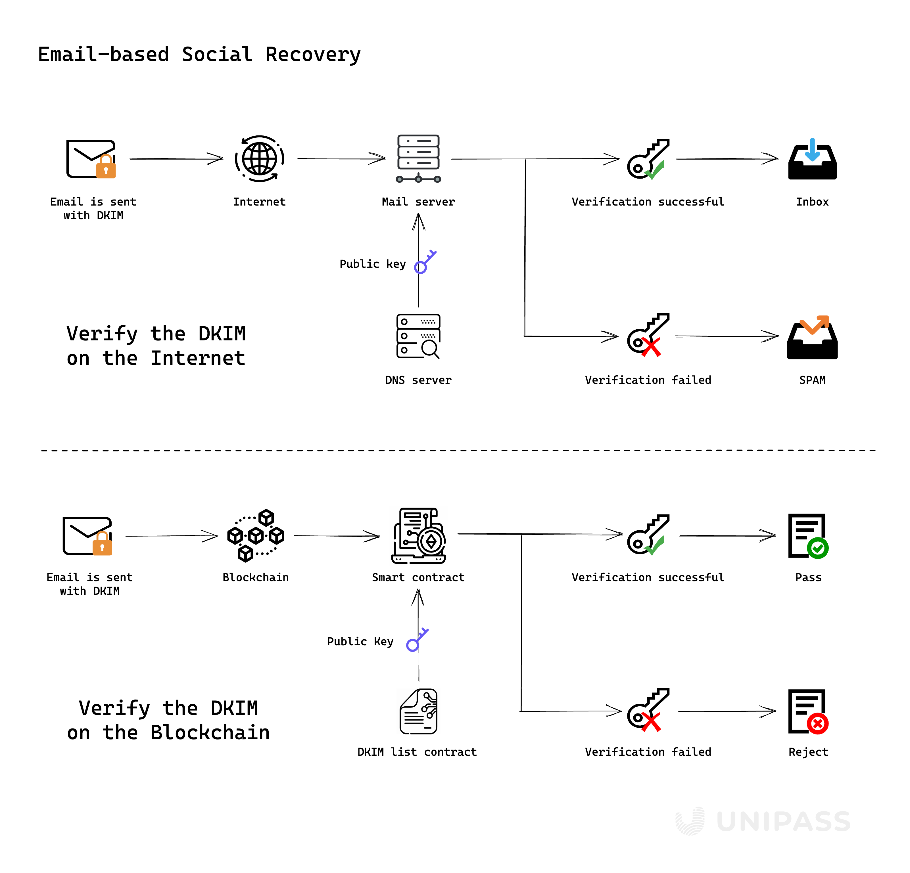

# Email On-chain Verification

UniPass invented an on-chain email verification technique. We can verify email’s DKIM signature on chain to achieve social recovery of the contract account.

## What is DKIM

[**DomainKeys Identified Mail**](https://datatracker.ietf.org/doc/html/rfc6376) (DKIM) is a widely adopted email authentication method that allows the receiver to check that an email was indeed sent and authorized by the owner of the specified domain, and not modified by a third party.

DKIM has two primary parts that work together to authenticate emails:

- DKIM Digital Signature: For every email sent from your domain, DKIM offers an encrypted, private digital signature.
- Public Key: To validate the outgoing server's signature, the receiving email server can utilize the public key listed in DNS.

The receiving server may validate your email's legitimacy and that it was not altered during transport by looking up the DKIM signature. The email's digital signature won't be verified if an attacker intercepts it and alters it or sends a phony email from your domain.
