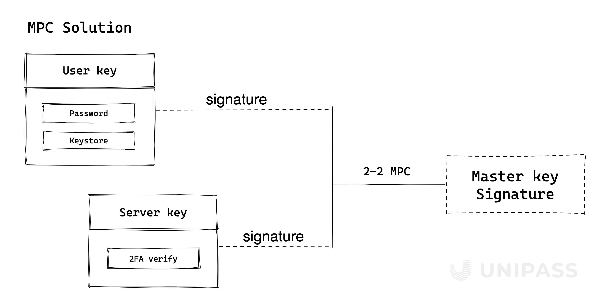

# Master key

## Master key 的结构

UniPass Wallet 在 Master key 中采用了 2-2 门限签名 (TSS) 方案，用户在链上会保持一个较为恒定的 Master key。

2 个密钥分片分别是：

- `User key`：将会以 “密码 + keystore” 的形式存在，密码由用户自己保存，keystore 用户可以保存在云端服务器（如 iCloud、Google Drive 等）或者托管在信任的第三方存储中。
- `Server key`：目前将由 UniPass 官方进行安全管理，用户通过 2FA 验证身份来获得 Key 操作权限。2FA 验证将包括：邮箱/手机验证码，谷歌验证器，OAuth 验证，WebAuthn 等。

## 什么是 TSS 方案

作为安全多方计算（Secure Multi-Party Computation，简称 MPC 或 SMPC）的一个子领域，门限签名方案（Threshold Signature Scheme，简称 TSS）是用于分布式密钥生成和签名的加密协议。

TSS 可以帮助多方共同管理私钥，并允许灵活的定义阈值策略。 例如，三个参与方通过分布式密钥生成 (DKG）私钥的秘密分片（secret shares），然后共同计算出公钥。由于各自持有的 secret shares 不会透漏给其他参与方，因此私钥不会在任何时刻被重构出来。为了进行交易签名，将需要至少两方参与的签名数据整合在一起才能构建有效签名。

- TSS 使得单点受损不会对资产造成风险。
- 通过 resharing 方法可在保持私钥不变的情况下重新更新各方 share，使旧的 shares 失效，而不定期 shares 轮换可进一步提升密钥管理的安全性。

了解更多关于 TSS，可以参见：[**Threshold Signatures Explained**](https://academy.binance.com/en/articles/threshold-signatures-explained)。

### TSS VS 传统 Multisig（多重签名）

TSS 使用链下分布式多方计算技术，它比 multisig 方案更加高效，TSS 最终只有 1 个签名，而不是 n 个签名。并且多重签名发生在链上，这可能会消耗更多资源，多重签名的参与者（公钥）会暴露在区块链中，成为潜在的攻击点。

### TSS VS Shamir's Secret Sharing（SSS）方案

SSS 的密钥分片生成需要先由一个单方生成私钥然后将私钥分片，再分发私钥分片给各参与方，而在签名时，各方必须重构完整的私钥以进行签名，这导致密钥初始生成时以及每次需要签名的过程中都会出现单点故障。而在 TSS 中，无论是密钥分片的生成还是签名，都是以分布式计算进行的从而不需要重构私钥。
