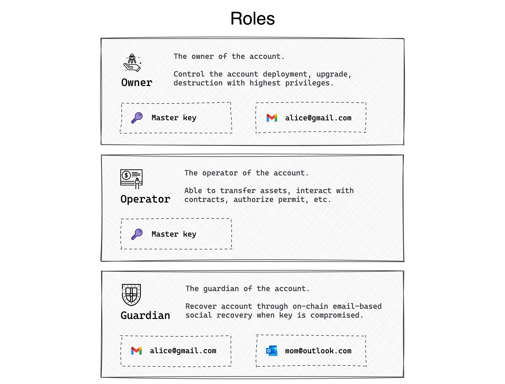

# Key Management

## Key structure

When a user registers for a UniPass Wallet account, a smart contract is deployed on the chain for each user, and the data and logic connected with that account is saved within the contract.

Users manage their accounts in UniPass Wallet's smart contract via a sequence of keys with role weights. The user can set many different sorts of keys in addition to the [Master key](./03-master-key.md), which is implemented in a secure multi-party computation (MPC) scheme. Each key has a specific function and weight. Only after accumulating more weights than are necessary for that role can a user carry out the relevant actions permitted for that role.

## Keys and algorithms

Different key types are supported by UniPass Wallet in the contract.

Externally Owned Accounts (EOA), which we frequently utilize, and contract accounts that comply with the EIP-1271 protocol are supported.

Email addresses can also be used as keys by UniPass users. The smart contract we will implement on the blockchain will be able to verify DKIM to cryptographically validate the user's ownership of an Email.To maintain the confidentiality and security of users' email information, UniPass uses zero-knowledge proof technology during the verification process.

In the future, UniPass Wallet will also support more efficient and concise signature algorithms than secp256k1 (e.g., Schnorr, BLS), post-quantum secure signature algorithms (e.g., Lamport, Winternitz), and so on.

## Roles and Weight

There are mainly three roles for keys:

:::info 👤 Owner

Owner is the account's owner and has the ultimate authority when it comes to controlling the account's basic operations, including deployment, upgrade, and deletion.

:::

:::info 💵 Operator

Operator is the executor of the account's assets and is in charge of all asset transfers, contract invocations, licensing, and other activities. The key that users most used.

:::

:::info 🛡️ Guardian

Guardian is the guardians of the account. Guardians can be used to retrieve the account if the keys are lost or deleted and the user no longer has access to it. On-chain email social recovery is one of the features that only UniPass has.

:::

A key may be given to a single role or several roles. A key is given a commensurate weight when it is allocated to a role. A user must sign with one or more keys that together have a total weight of `100` or above for that role in order to begin executing actions linked to that role.

Of course, for users who do not have complicated customization needs. UniPass Wallet will naturally take into account the user's current account situation, including the total amount of assets on the account and the registration time, as well as the various types of keys the user currently has bound, and intelligently recommend roles and weight settings for the user to achieve a secure and practical key management experience.

Developers can create intricate customizations based on UniPass Wallet's support for multiple key types and adaptable role weighting system to cater to the needs of various users and scenarios. Please feel free to get in touch with us through [Discord](https://discord.gg/XaRMFW85Pg), [Twitter](https://twitter.com/UniPassID), [Email](mailto:contact@unipass.id).
