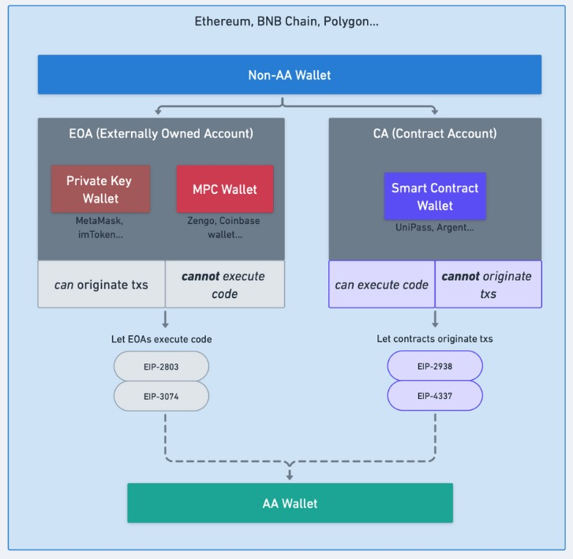

# What is UniPass Contract?

**Smart Contract Wallet** refers to a wallet that uses a contract account as its address. On the Ethereum, there are two types of accounts: **Externally Owned Account** (EOA) and **Contract Account** (CA).

EOA is the type of account most ordinary users use. It consists of a private key and a public key. The private key represents ownership and control, while the public key represents the account address. Whoever possesses the private key has control over the EOA. If the private key is lost or stolen, the funds in the account cannot be recovered. EOAs can initiate transactions and validate them using the ECDSA private key signature algorithm. They can also deploy smart contracts.

In contrast, a contract address does not directly correspond to a private key. Contract accounts are controlled by code and cannot initiate transactions; they only execute predefined logic when triggered.

**UniPass Contract** is a contract developed by UniPass that enables Role-Based Access Control (RBAC) key management and supports on-chain verification through DKIM/OpenID.

## Features of UniPass Contract

* **Consistent Multi-Chain Addresses**: Users have consistent contract wallet addresses across various EVM-based chains.

* **Flexible Key Management**: Implements role-based key permission management.

* **Low-Threshold Social Recovery**: Supports social recovery through sending an email.

* **Modular Contract**: Implemented in a modular way, allowing the addition of plugins.

* **Flexible Gasless Transactions**: Supports custom relayers and is compatible with the ERC-4337 standard.

## UniPass Contract vs. Other Wallet Contracts

For smart contract wallets, key management is a crucial aspect, and currently, there are three main types of key management systems:

- Similar to **Safe**: Multi-signature logic that allows 2/3, 3/5, etc. multi-signature setups.

- Similar to **Sequence**: Simple permission management that allows setting weights on keys and performing account operations with a threshold.

- Similar to **UniPass**: RBAC-based permission management that allows setting weights and roles on keys. Different roles can execute different operations, and each role has its threshold for activation.

In addition, social recovery is also a significant feature of smart contract wallets. However, most smart contract wallets in the market only support adding other EOA addresses for social recovery, which places higher requirements on the wallet's guardians.

UniPass Contract brings on-chain [DKIM verification](./04-email-on-chain-verification.md) for social recovery, making it possible to implement genuine "social recovery" and significantly reducing the barriers for guardians to assist in recovery.