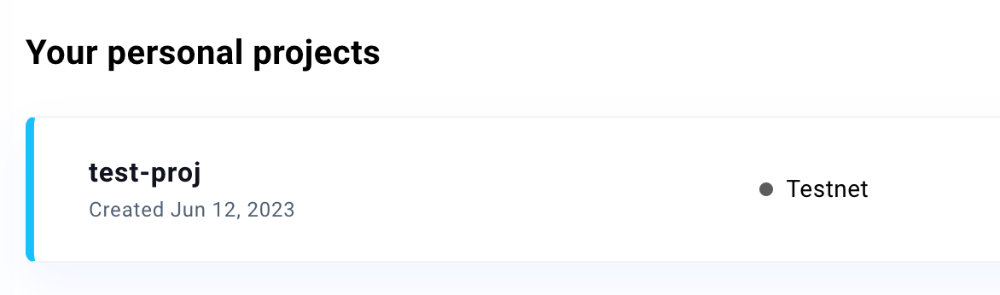

# Init Master Key from Wallet Services

Master key the main signer for signing messages and transactions. It has to inherit the `Signer` in `ethers.js`.

## Init Master Key from Web3Auth

Before integrate with Custom Auth SDK, you need to create a Web3Auth project first, here is a brief [tutorial](#how-to-create-a-web3auth-project).

### Select [Web3Auth Single Factor Auth SDK](https://web3auth.io/docs/sdk/core-kit/sfa/) (Custom UI)

If you need to integrate your own social logins like Google and want to have complete UI customization, you can choose Web3Auth's Single Factor Auth SDK to integrate with Custom Auth SDK.

This is an example of **web3auth/single-factor-auth** using google OAuth, you can refer to the [Web3Auth docs](https://web3auth.io/docs/sdk/core-kit/sfa/install) for more detailed configuration.

#### Step1: Install **@web3auth/single-factor-auth**

```jsx
yarn add @web3auth/single-factor-auth
// or
npm install --save @web3auth/single-factor-auth
```

#### Step2: Init Web3Auth and get signer

```jsx
import { Web3Auth } from "@web3auth/single-factor-auth";

const web3auth = new Web3AuthNoModal({
  clientId: Web3AuthClientId, // replace Web3AuthClientId with your client id
  chainConfig: {
    chainNamespace: 'eip155',
    chainId: '5',
    rpcTarget: 'https://rpc.ankr.com/eth_goerli' // or you can replace your own rpcNodeUrl
  },
  web3AuthNetwork: 'testnet'
})
await web3auth.init()
const web3authProvider = await web3auth.connect({
    verifier: verifierName, // e.g. `web3auth-sfa-verifier` replace with your verifier name, and it has to be on the same network passed in init().
    verifierId,
    idToken,
  })
if (web3authProvider) {
  const provider = new providers.Web3Provider(web3authProvider as providers.ExternalProvider)
  const signer = provider.getSigner() // this is what we need
}
```

:::tip
You can find your Web3Auth client id in your project.


:::


### Select [Web3Auth Modal SDK](https://web3auth.io/docs/sdk/pnp/web/modal/) (Using Web3Auth UI)

If you prefer not to integrate social logins like Google yourself and are willing to use the UI provided by Web3Auth, you can choose Web3Auth's Modal to integrate with Custom Auth SDK.

#### Step1: Install **@web3auth/modal**

```jsx
yarn add @web3auth/modal
// or
npm install @web3auth/modal
```

#### Step2: Init Web3Auth and get signer

```jsx
const web3auth = new Web3Auth({
  clientId: Web3AuthClientId, // replace Web3AuthClientId with your client id
  chainConfig: {
    chainNamespace: 'eip155',
    chainId: '5',
    rpcTarget: 'https://rpc.ankr.com/eth_goerli' // or you can replace your own rpcNodeUrl
  },
  web3AuthNetwork: 'testnet'
})
await web3auth.initModal()
const web3authProvider = await web3auth.connect()
if (web3authProvider) {
  const provider = new providers.Web3Provider(web3authProvider as providers.ExternalProvider)
  const signer = provider.getSigner() // this is what we need
}
```

:::tip
You can find your Web3Auth-client id in your project.


:::

---

## How to create a Web3Auth project

1. Sign up Web3Auth
    
Web3Auth dashboard: [https://dashboard.web3auth.io](https://dashboard.web3auth.io/)
    


2. Select solution in menu
  * If you choose the Web3Auth Single Factor Auth SDK, please select Custom Auth.
  * If you choose the Web3Auth Modal SDK, please select Plug & Play.


3. Create project


4. Set information of your project


5. Create project successful

