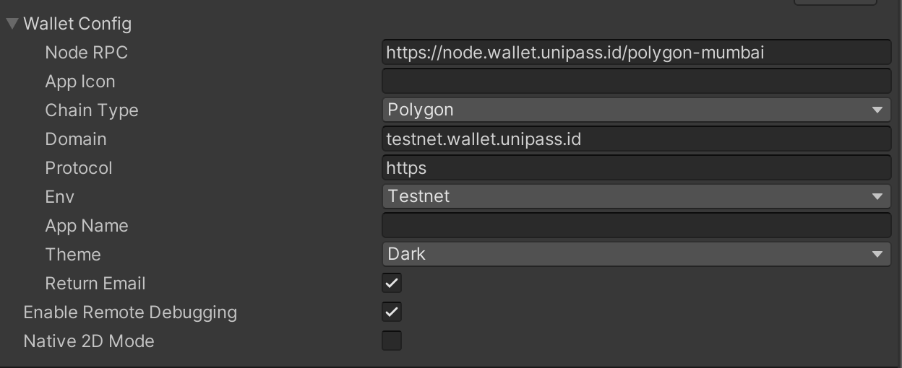

# Initialization

Create an instance with a `WalletConfig` object to customize.

```csharp
[System.Serializable]
public class WalletConfig
{
    public enum Environment
    {
        testnet, mainnet,
    }

    public enum ChainType
    {
        polygon, bsc, rangers,
    }

    public enum Theme
    {
        dark, light,
    }

    public string nodeRPC = "https://node.wallet.unipass.id/polygon-mumbai";

    public string appIcon = "";

    public ChainType chainType = ChainType.polygon;

    public string domain = "t.wallet.unipass.id";

    public string protocol = "https";

    public Environment env = Environment.testnet;

    public string appName = "";

    public Theme theme = Theme.dark;
}

```

## Code sample

```csharp
public Wallet wallet;
```

