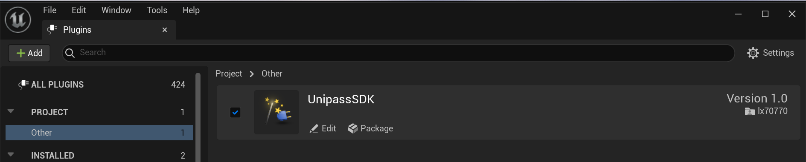

# Quick Start

| Version | Last updated | UniPass Wallet Entry URL | UPgrade Instruction |
| --- | --- | --- | --- |
| v0.0.1 | 2022.12.09 | https://testnet.wallet.unipass.id/ | Add Connect / Transfer / Sign Message support |

## Resources

- [Unreal SDK GitHub](https://github.com/UniPassID/Unipass-UE-SDK)

:::tip
UniPass Wallet entry URL used by current demo: [https://testnet.wallet.unipass.id/](https://testnet.wallet.unipass.id/login)
:::

### Windows

Try demo on Windows. Please download portable executable file of Windows from Google drive.

- [unipass_ue_demo_0.0.1](https://drive.google.com/file/d/1lOWhpTuqQ8RXe9W5eC6XWx93vHM7vXxF/view?usp=sharing)

## System Requirements

- Unreal Engine 5 version: `5.0.3`

## Installation

There are two ways to install UniPass SDK：

1. Install UniPass SDK to local UE5 project
    - Open your project root directory which `[ProjectName].uproject` locate at
    - Create a directory, and set its name to `Plugins` . If `Plugins` already exists, skip this step.
    - Copy directory `Plugins/UniPassSDK` of UniPass SDK to `Plugins` directory.
2. Install UniPass SDK globally
    - Open Unreal Engine’s default installation path. The default path on Windows is `C:\Program Files (x86)\Epic Games\Launcher\Engine`
    - Copy directory `Plugins/UniPassSDK` of UniPass SDK to `Plugins` directory of Unreal Engine’s default installation path.

Open UE5 Editor, navigate to `Menu → Edit → Plugins` , check the option to enable UniPassSDK.

