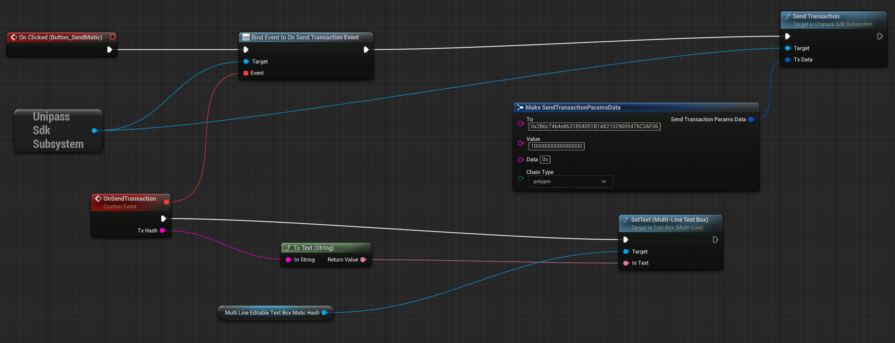

#  Send Transaction

    
create a `Send Transaction` function in the Widget Blueprint, and then complete its parameters.

1. `SendTransactionParamsData`: transaction parameter, it including:
    - `To`: transaction target address
    - `Value`: transaction value, which unit is wei
    - `Data`: transaction data
    - `ChainType`: chain type (polygon, eth, bsc, rangers)
2. `OnSendTransaction Event`: when user confirmed transaction request in UniPass Wallet, a transaction hash will be return as event data

