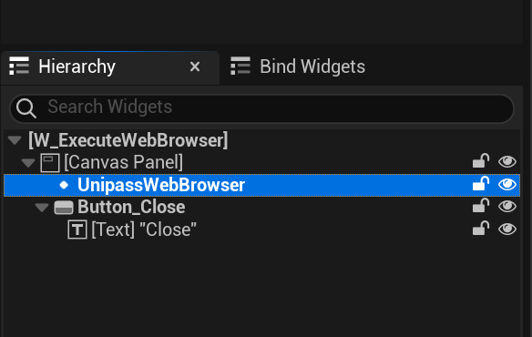
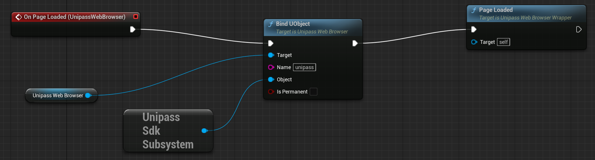
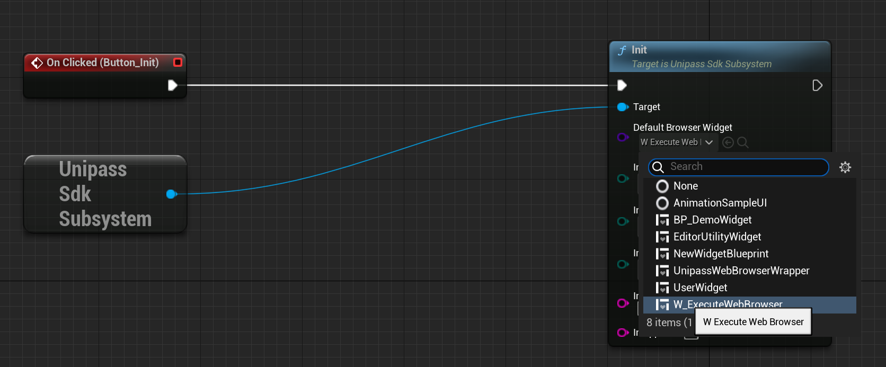

# Customize WebBrowser

If the defaulted `W_ExecuteWebBrowser` can not meet your requirements，you can customize  Browser Blueprint by your own.

1. Create a Widget Blueprint extends from `UnipassWebBrowserWrapper`

2. Drag `UnipassWebBrowser` to Widget Blueprint

3. Inject global variable `unipass` to window object of WebBrowser

4. Implement browser functions: `LoadURL`, `ExecuteJavascript` and other browser functions refer to **UnipassWebBrowser.cpp**

5. When your customized WebBrowser created successfully. you can use your customized WebBrowser for UnipassSDK Initialization instead of `W_ExecuteWebBrowser`.

