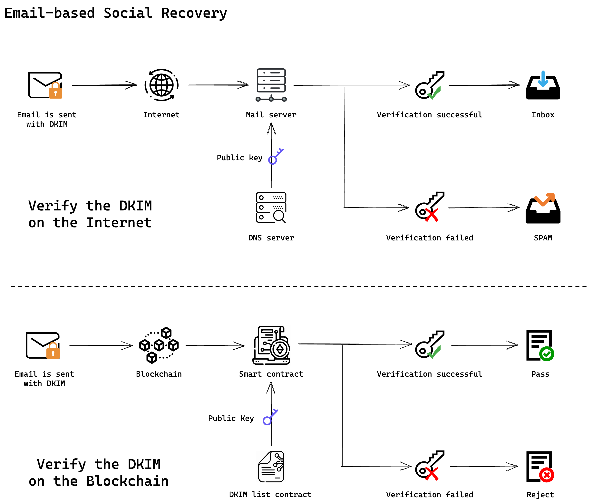

# 邮件链上验证

如何在链上验证一封邮件，是 UniPass 独创的链上邮件验证技术。我们通过在链上验证邮件的 DKIM 签名，从而证明一封邮件内容的真实性，进而在链上实现账户社交恢复这样的复杂流程。

## 什么是 DKIM

[**域名密钥识别邮件**](https://datatracker.ietf.org/doc/html/rfc6376)（DomainKeys Identified Mail，简称 DKIM）是一套电子邮件认证机制，使用公开密钥加密的基础提供了数字签名与身份验证的功能，以检测发件人、主题、正文、附件等部分是否有被伪冒或窜改。

DKIM 是所有电子邮件供应商和用户广泛采用和强烈推荐的标准。

DKIM 作为一个电子邮件认证协议，主要由两个部分组成：

- DKIM 数字签名：DKIM 为来自你的域名的每封电子邮件提供了一个加密的、私有的数字签名。
- 公开密钥：接收电子邮件的服务器可以使用你的 DNS 中公布的公钥来验证发件服务器的签名。

通过验证 DKIM 签名，接收服务器可以确认，你的电子邮件是合法的，并且在传输过程中没有被修改过。如果一个攻击者截获并修改了电子邮件，或者从你的域名发送了一封假的电子邮件，则数字签名将无法通过验证。