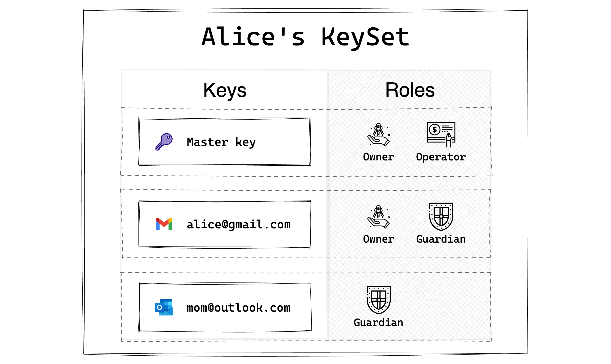
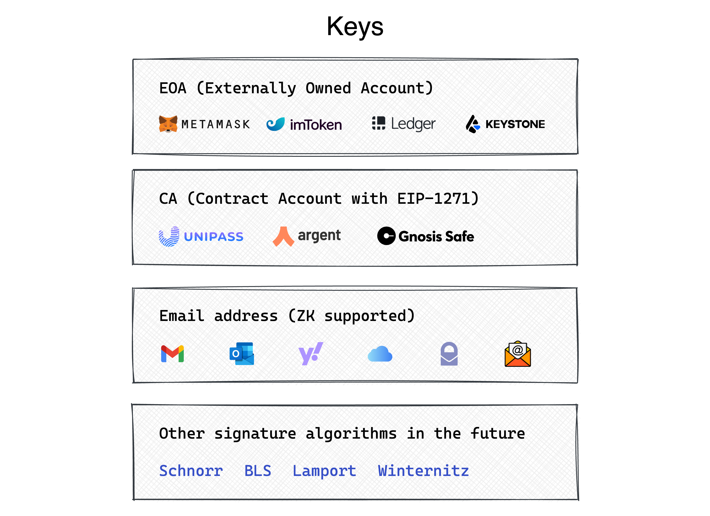

# 密钥管理

## 账户结构

用户注册 UniPass Wallet 账户时，会给每个用户在链上部署一个智能合约，合约内会存储着这个账户相关的数据和逻辑。

在 UniPass Wallet 的智能合约中，用户是通过一系列具有角色权重的密钥来管理账户的。

## 密钥

UniPass Wallet 的合约账户中支持多种类型的密钥。

已经支持的包括我们经常使用的外部地址，支持 EIP-1271 的合约账户。UniPass 还可以在链上密码学地验证用户对于一个互联网邮箱地址是所有权，在验证过程中，UniPass 采用了零知识证明技术，确保用户的隐私安全。

在未来 UniPass Wallet 还将考虑支持相比于 secp256k1 更高效更简洁的签名算法（比如：Schnorr，BLS），后量子安全签名算法（比如：Lamport，Winternitz）等等。

## 角色

密钥主要有三种角色：

:::info 👤 Owner

Owner 是账户的所有者。Owner 控制账户的部署、升级、销毁等核心功能，是账户的最高权限控制者。

:::

:::info 💵 Operator

Operator 是账户资产的执行者。Operator 负责账户的资产转账、合约调用、授权许可等功能，是用户日常使用的密钥。

:::

:::info 🛡️ Guardian

Guardian 时账户的守护者。当账户内的密钥损毁或丢失，用户失去账户控制时，可以通过 guardian 来恢复账户。UniPass 提供的一大特色功能就是：链上邮件社交恢复。

:::

每一个角色都有对应的权重，当某一角色验证通过的权重达到 `100` 时，则可以执行该角色允许的相关操作。

UniPass Wallet 支持多种密钥和角色的验证方式，账户设置的灵活性非常强，开发者可以进行深度的自定义以满足不同用户、不同场景的需求。欢迎通过 Discord，Twitter，Email 联系我们，与我们交流。