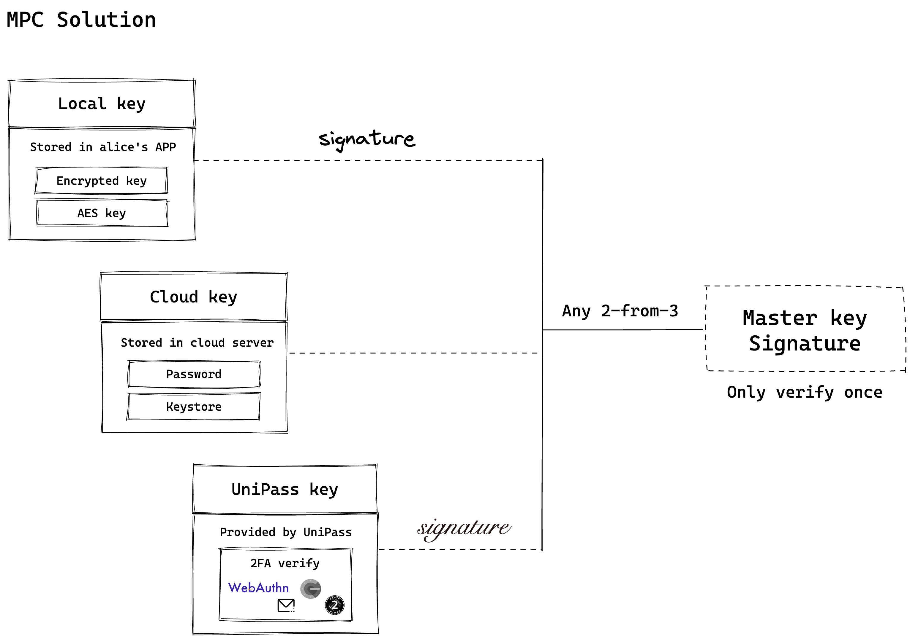

# Master key

## Master key 的结构

UniPass Wallet 在 master key 中采用了 2-2 TSS 方案，用户在链上会保持一个较为恒定的 master key。

用户的 Master key 由 2 个密钥分片和 1 个纠删码组成，当用户凑齐 2 个分片或者 1 个分片和 1 个纠删码时，即可生成有效的签名。

2 个密钥分片分别是：

- Local key：将会以加密的形式存储在用户本地，无法导出。
- UniPass key：将由 UniPass 官方进行安全管理，用户通过 2FA 验证身份来获得Key操作权限。2FA 验证将包括：邮箱/手机验证码，谷歌验证器，OAuth 验证，WebAuthn 等。

1 个纠删码是：

- Cloud key：将会以 “密码 + keystore” 的形式存在，密码由用户自己保存，keystore 用户可以保存在云端服务器（如 iCloud、Google Drive 等）或者托管在信任的第三方存储中。

## 什么是 TSS 方案

working on it