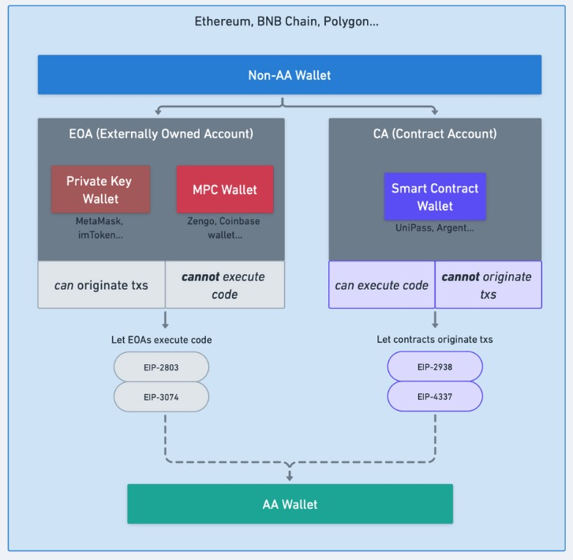

# UniPass Contract 是什么?

**智能合约钱包（Smart Contract Wallet）是指用合约账户作为地址的钱包**。在以太坊上，有两种账户：EOA（Externally Owned Account）和合约账户 (Contract Account)。

EOA 是目前大多数普通用户使用的账户。EOA 由私钥和公钥组成。私钥代表了控制权，而公钥代表了账户地址。谁掌握了私钥，谁就有了对 EOA 的控制权，若私钥一旦丢失、被盗，账户内的资金将无法找回。EOA 可以主动发起交易，并通过 ECDSA 私钥签名算法的方式验证交易，也可以发起部署智能合约的行为。

与 EOA 不同，合约地址并不直接对应私钥。合约账户是由代码控制，它不能主动发起交易，只有在被触发后按照预先编写的代码执行相关逻辑。

**UniPass Contract** 是 UniPass 开发的具备 RBAC（Role-Based Access Control） 密钥管理，支持 DKIM/OpenID 链上验证的合约。

## UniPass Contract 的特色

* **`多链地址一致`**：用户在各条 EVM 上的合约钱包地址一致

* **`灵活的密钥管理`**：实现了基于角色的密钥权限管理

* **`低门槛社交恢复`**：支持通过发送邮件进行社交恢复

* **`模块化合约`**：通过模块化的方式实现合约，支持添加 plugin

* **`灵活的 Gasless`**：支持自定义 relayer，也兼容 ERC-4337 标准

## UniPass Contract VS 其他 Wallet Contract

对于智能合约钱包，最核心的就是密钥管理，目前智能合约钱包的密钥管理系统主要可以分成以下三种：

- 类似于 **Safe**：多签逻辑。只能实现 2/3，3/5 这样的多签逻辑

- 类似于 **Sequence**：简单的权限管理。可以给 key 设置权重，然后操作账户有一个阀值，超过这个阀值即可控制账户

- 类似于 **UniPass**：RBAC，基于角色的权限管理。可以给 key 设置权重和角色，不同的角色可以执行不同的操作，每个角色也有对应的阀值，超过这个阀值即可执行对应角色的权限

另外社交恢复也是智能合约钱包的一大特色，但是目前市面上其他智能合约钱包通常只支持添加其他 EOA 地址进行社交恢复，这就对智能合约钱包的守护者提出了较高的要求。

UniPass Contract 将 [DKIM 验证](./04-email-on-chain-verification.md)搬到了链上，可以实现基于邮件的社交恢复，大大降低了守护者的门槛，有望实现真正的“社交恢复”。

## 开源 & 审计

UniPass Contract 目前已在 [GitHub](https://github.com/UniPassID/Unipass-Wallet-Contract) 开源，经过了 BlockSec 和 Salus 两家在区块链领域内备受尊重的公司的独立[审计](../audits/01-overview.md)。

