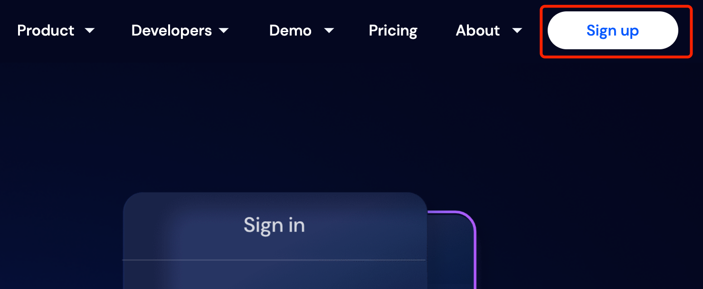
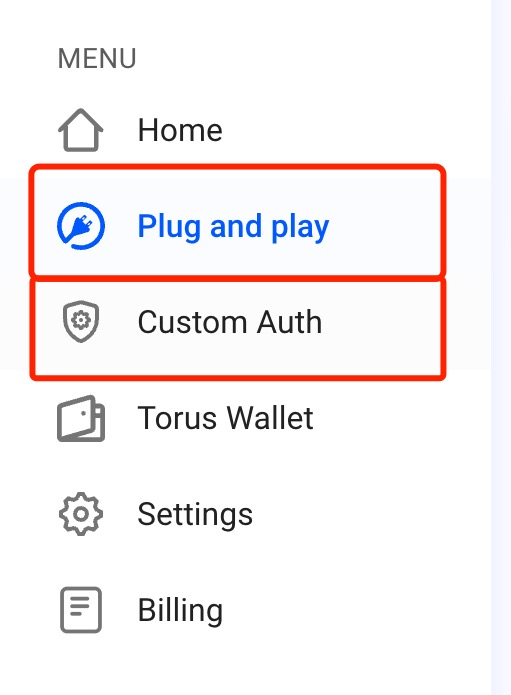
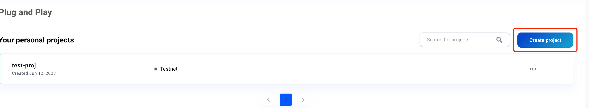
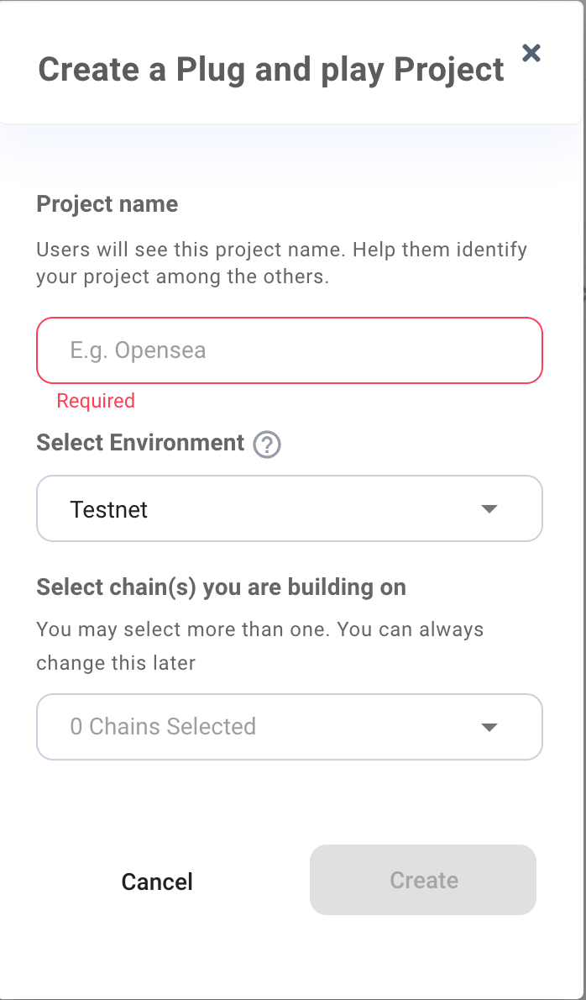
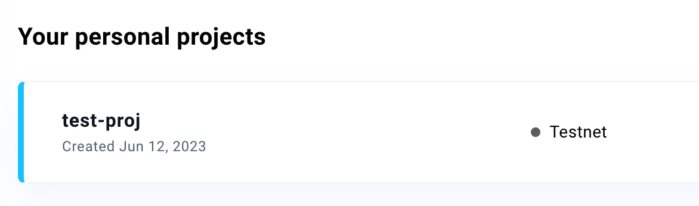

# 将钱包服务作为 Master Key

Master key 是签名消息和交易的 singer，需要从钱包服务获取 `signer`。

## 从 Web3Auth 初始化 singer

在集成 Custom Auth SDK 之前，您需要首先创建一个 Web3Auth 项目，这里是一个简要的[教程](#how-to-create-a-web3auth-project)。

### 选择 [Web3Auth Single Factor Auth SDK](https://web3auth.io/docs/sdk/core-kit/sfa/)（可自定义 UI）

如果您需要集成自己的社交登录，如 Google，并且想要进行完全的 UI 自定义，您可以选择 Web3Auth 的单因素认证 SDK 来与 Custom Auth SDK 集成。

这是一个使用 Google OAuth 的 **web3auth/single-factor-auth** 的示例，您可以参考 [Web3Auth 文档](https://web3auth.io/docs/sdk/core-kit/sfa/install) 获取更详细的配置信息。

#### Step1: 安装 **@web3auth/single-factor-auth**

```jsx
yarn add @web3auth/single-factor-auth
// or
npm install --save @web3auth/single-factor-auth
```

#### Step2: 初始化 Web3Auth 并获取 signer

```jsx
import { Web3Auth } from "@web3auth/single-factor-auth";

const web3auth = new Web3AuthNoModal({
  clientId: Web3AuthClientId, // replace Web3AuthClientId with your client id
  chainConfig: {
    chainNamespace: 'eip155',
    chainId: '5',
    rpcTarget: 'https://rpc.ankr.com/eth_goerli' // or you can replace your own rpcNodeUrl
  },
  web3AuthNetwork: 'testnet'
})
await web3auth.init()
const web3authProvider = await web3auth.connect({
    verifier: verifierName, // e.g. `web3auth-sfa-verifier` replace with your verifier name, and it has to be on the same network passed in init().
    verifierId,
    idToken,
  })
if (web3authProvider) {
  const provider = new providers.Web3Provider(web3authProvider as providers.ExternalProvider)
  const signer = provider.getSigner() // this is what we need
}
```

:::tip
您可以在您的项目中找到 Web3Auth client id。


:::


### 选择 [Web3Auth Modal SDK](https://web3auth.io/docs/sdk/pnp/web/modal/)（使用 Web3Auth 的 UI）

如果您不希望自己集成 Google 等社交登录，并且愿意使用 Web3Auth 提供的 UI，您可以选择 Web3Auth 的 Modal 来与 Custom Auth SDK 集成。

#### Step1: 安装 **@web3auth/modal**

```jsx
yarn add @web3auth/modal
// or
npm install @web3auth/modal
```

#### Step2: 初始化 Web3Auth 并获取 signer

```jsx
const web3auth = new Web3Auth({
  clientId: Web3AuthClientId, // replace Web3AuthClientId with your client id
  chainConfig: {
    chainNamespace: 'eip155',
    chainId: '5',
    rpcTarget: 'https://rpc.ankr.com/eth_goerli' // or you can replace your own rpcNodeUrl
  },
  web3AuthNetwork: 'testnet'
})
await web3auth.initModal()
const web3authProvider = await web3auth.connect()
if (web3authProvider) {
  const provider = new providers.Web3Provider(web3authProvider as providers.ExternalProvider)
  const signer = provider.getSigner() // this is what we need
}
```

:::tip
您可以在您的项目中找到 Web3Auth client id。


:::

---

## 如何创建 Web3Auth 项目

1. 注册 Web3Auth
    
Web3Auth dashboard: [https://dashboard.web3auth.io](https://dashboard.web3auth.io/)
    


2. 在目录中，选择方案
    * 如果你选择 Web3Auth Single Factor Auth SDK，请选择 Custom Auth
    * 如果你选择 Web3Auth Modal SDK，请选择 Plug & Play



3. 创建项目



4. 设置项目信息



5. 创建项目成功

