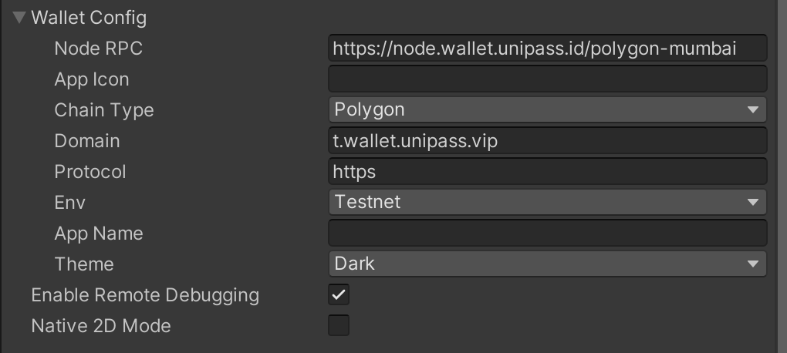

# 初始化

创建 UniPass Wallet 实例，并通过 `WalletConfig` 传入自定义的配置信息。

```csharp
[System.Serializable]
public class WalletConfig
{
    public enum Environment
    {
        testnet, mainnet,
    }

    public enum ChainType
    {
        polygon, bsc, rangers,
    }

    public enum Theme
    {
        dark, light,
    }

	public enum ConnectType
    {
        both, google, email
    }

    // for polygon mumbai
    // chainType: "polygon",
    public string nodeRPC = "https://node.wallet.unipass.id/polygon-mumbai";

    // for eth testnet
    // chainType: "eth",
    // public string nodeRPC =  "https://node.wallet.unipass.id/eth-goerli",

    // for bsc testnet
    // chainType: "bsc",
    // public string nodeRPC = "https://node.wallet.unipass.id/bsc-testnet",

    // for rangers robin
    // chainType: "rangers",
    // public string nodeRPC = "https://node.wallet.unipass.id/rangers-robin",

    public string appIcon = "";

    public ChainType chainType = ChainType.polygon;

    public string domain = "t.wallet.unipass.id";

    public string protocol = "https";

    public Environment env = Environment.testnet;

    public string appName = "";

    public Theme theme = Theme.dark;

	public bool returnEmail = false;
}
```

## 创建实例

```csharp
public Wallet wallet;
```


