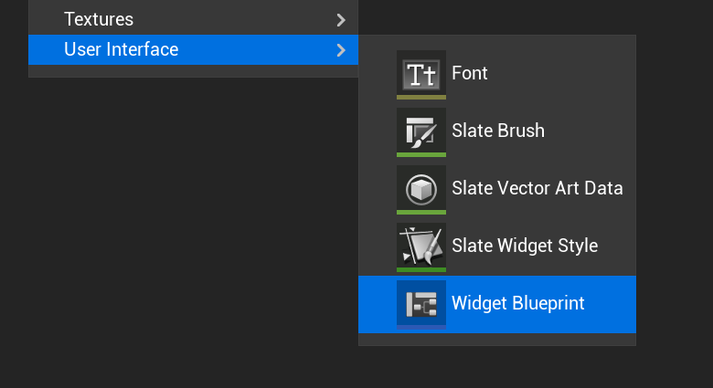
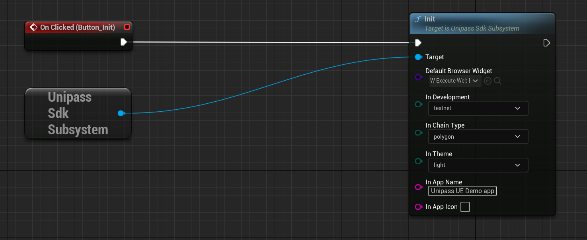

# 初始化

1. 创建一个 Widget Blueprint

2. 初始化 UniPassSDK
   - Default Browser Widge t 传入 SDK 中自带的 W_ExecuteWebBrowser，**不过您也可以按照 W_ExecuteWebBrowser 蓝图的结构，创建自己的 WebBrowser 蓝图**
   - In Development: 开发环境选择，testnet 或者 mainnet
   - In Chain Type: 公链选择，polygon、eth、bsc、rangers
   - In App Name: 您的产品名称，将会显示到 UniPass 页面中
   - In App Icon: 您的产品 logo 的 URL 地址（请关闭此 logo 地址的跨域限制）

