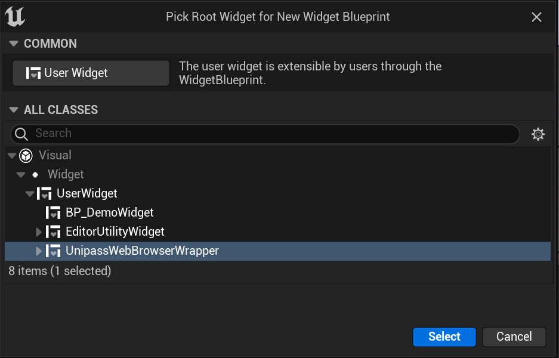
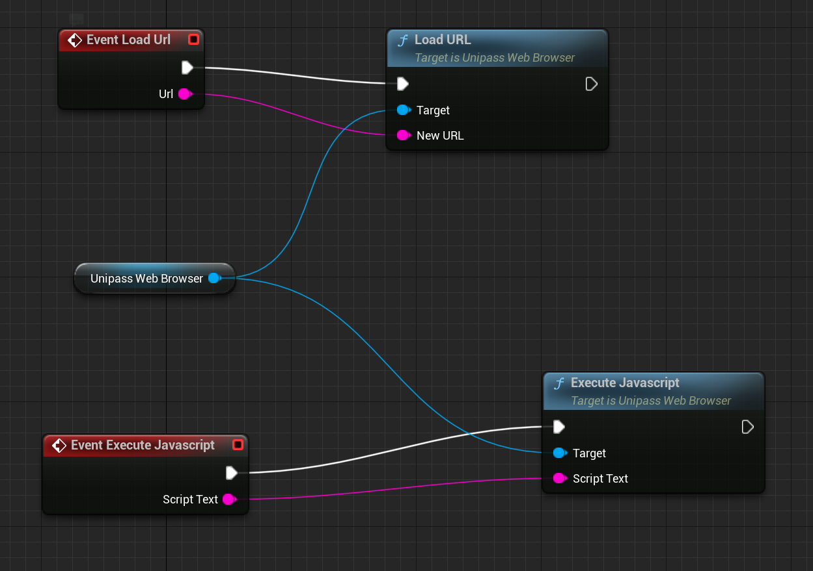

# 自定义 WebBrowser

SDK 中默认 W_ExecuteWebBrowser 可能不满足您的需求，您可以自定义 Browser 蓝图类

1. 创建一个自定义蓝图，须继承自 `UniPassWebBrowserWrapper`

2. 将 `UniPassWebBrowser` 拖入蓝图中

3. 将 unipass 全局字段注入到 WebBrowser 中，UniPass 前端会识别当前浏览器环境中是否存在 unipass 全局变量，若不注入，会导致无法正常使用 UniPass 钱包

4. 实现浏览器方法，加载 URL、执行 JavaScript，或者加入一些额外的浏览器方法，具体方法列表请查看 UniPassWebBrowser.cpp 代码

5. 创建完成后，在初始化流程中替换掉 SDK 中的 `W_ExecuteWebBrowser`

