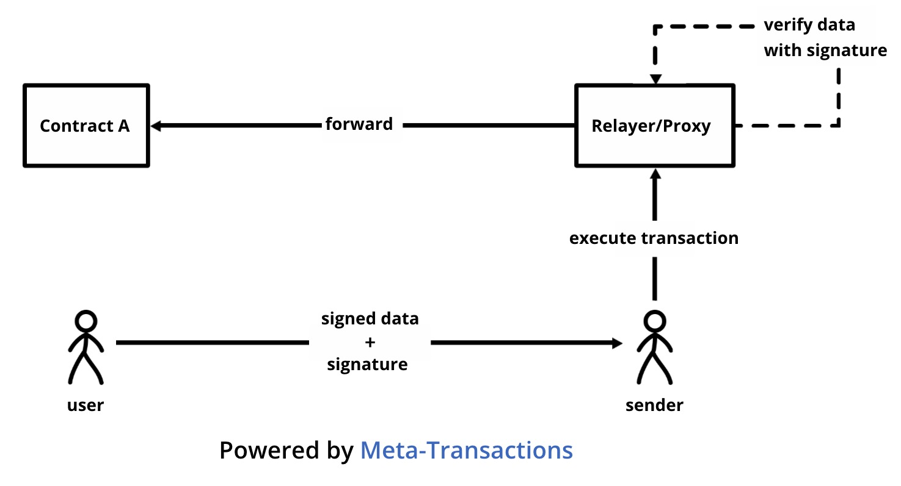

# FAQ

## 优势 & 区别

### UniPass 合约钱包 vs EOA 钱包（游戏内置钱包）的优势？

核心优势主要体现在提高用户转化率和资产安全。展开来说，UniPass 合约钱包对优势有以下几个方面：

1. UniPass 合约钱包的创建过程不涉及助记词概念，可以通过 Google OAuth 或邮箱直接创建。把助记词去掉对 Web2 用户来说，不仅大幅简化了操作流程，降低认知门槛，还杜绝了因为助记词管理不当造成的不可逆损失。
2. UniPass 合约钱包支持社交恢复，即用户即便由于严重入侵导致合约钱包控制权丢失后，依然可以在守护者的协助下，重新拿回账户的控制权，相比之下 EOA 钱包的泄露是不可逆的。
3. UniPass 合约钱包可以实现免 Gas 的用户体验。免 Gas 的用户体验可以大幅减轻早期参与游戏过程中的出入金负担，避免用户在深入游戏之前流失，免 Gas 体验在多链型链游中的体验提升尤为明显，用户无需每条链都专门去购买相应的 Gas 代币。
4. UniPass 合约钱包可以进行合约逻辑升级，从而实现如链下授权链上成交等灵活强大的功能，并且所有升级都不需要用户更换他在链上的地址。

### UniPass 合约钱包需要如何验签，与 EOA 钱包验签的区别？

当应用合约需要在链上对 UniPass 合约钱包进行验签时，可根据 [**EIP-1271**](https://eips.ethereum.org/EIPS/eip-1271) 协议调用 UniPass Wallet 合约进行验签。应用合约需要加入对 EIP-1271 协议的支持。

合约钱包与 EOA 钱包链上验签的区别：

- 合约钱包链上验签：是应用合约直接调用合约钱包的验签接口进行验签，此接口遵循 EIP-1271 协议。
- EOA 链上验签：是直接在应用合约内实现 Secp256k1 验签。

---

## 关于 Master key

### Master key 是如何生成的？

Master key 是由 `client slice` 和 `server slice` 进行 MPC-TSS 计算后生成的，master key 本身不存在私钥，只有一个计算出的公钥。

### Master key 保存在哪里？

`Client slice` 会在 client 端使用用户设置的密码（密码会进行 `scrypt` 处理）进行加密后，生成一个 keystore 文件。keystore 文件会保存在 UniPass 云端存储中，后续用户可将 keystore 存储至 Google Drive、iCloud 等第三方云盘或者下载至本地。

`Server slice` 是每个账户独立生成的，并使用 AWS 的 HSM（Hardware Security Module）进行加密保存，由 UniPass 对用户进行 2FA 后才可以调用。

综上所述，master key 由于没有对应的完整私钥，所以不存在私钥泄露的单点故障问题，其次参与签名的 client slice 及 server slice 均采取不同的安全方案独立存储，同时被破解且匹配的概率极低。

---

## 关于 Relayer

### Relayer 的作用和权限是什么？

Relayer 的作用仅为提交交易并代付 gas ，无法对用户签名的操作做任何更改。

### 免 gas 的原理和实现方式是什么？

免 gas 的体验是通过 [**Meta Transaction**](https://medium.com/coinmonks/ethereum-meta-transactions-101-de7f91884a06) （元交易）机制实现的。

首先，在合约钱包方案里用户的账户是一个智能合约，它的鉴权机制是内置的，也就是操作和签名是作为合约调用的参数传入内部，再由内部逻辑进行验签。那么可以看出，用户直接签署的内容（账户操作和签名）并非完整的 Layer 1 交易，而是它的核心内容，任何人在得到核心内容后，包装出一笔完整的 Layer 1 交易，并将其提交上链并支付需要的 gas 。用户签署的核心内容就被称作元交易。

换句话说，用户使用合约钱包的本质就是通过一笔 Layer 1 交易上链来改变智能合约的状态，而这一笔 Layer 1 交易至少包含两部分签名内容，一部分是用户对自己想做的操作给出的签名，在 data 字段里，可被传入合约去校验，只能由用户签署；另一部分是愿意协助提交 Layer 1 交易上链的 relayer 的签名，relayer 可以是任何人，它就是一笔正常交易所需的那部分，同时这个 relayer 需要才支付 gas 。

---

## 如果 UniPass 关闭了怎么办？

### UniPass Wallet 能否导出到传统钱包？

UniPass Wallet 是智能合约钱包，因为用户的地址不对应私钥，所以无法直接导出传统密钥或助记词。 但是用户可以把合约的控制权转移给某个 MetaMask 地址，类似 Gnosis safe 只用 1-1 单签的使用方法。

### 当 UniPass 停止服务时，如何迁移至 MetaMask？

UniPass 有一个基于电子邮件的社交恢复机制，它可以在没有任何 UniPass 或其他第三方（如 Zengo 的托管）的帮助下进行：如果 UniPass 的 bot（其功能是接收恢复邮件和验证）也失效了，用户可以下载一个开源的前端（用 Electron 编译为本地应用程序），并在他们的电脑上运行；或者还可以使用由 IPFS 托管的网页。具体迁移步骤如下：

1. 输入你的电子邮件地址 / UniPass 账户地址等信息
2. 输入你想在未来用来控制 UniPass 账户的目标地址（如 MetaMask 地址）。
3. 点击 "生成" 按钮，得到一个电子邮件模板（主题和正文），你可以把它们发送到你守护者的电子邮件地址。
4. 告诉你的守护者，将他们收到的邮件转发到你的邮箱。而如果你也用自己的电子邮件作为守护者，你可以将电子邮件模板发送到任何你能收到的电子邮件地址。
5. 从你的收件箱中下载电子邮件文件（.eml），然后用这个前端上传，同时使用你的 MetaMask 帮助打包交易上链即可。
